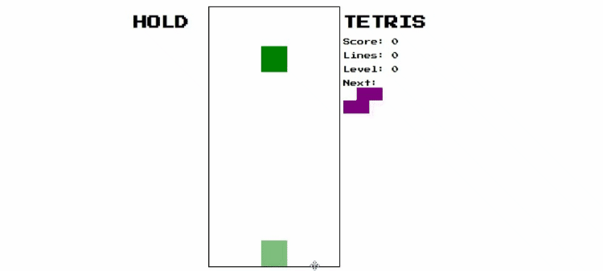

# Tetris Canvas
[Live Site](https://brkwok.github.io/tetris-canvas/)

## Introduction

This Tetris project is a modified version of [Michael Karén's Tetris tutorial](https://michael-karen.medium.com/learning-modern-javascript-with-tetris-92d532bcd057) . It retains the core gameplay mechanics while adding new functionalities to enhance the overall gaming experience.

## Gameplay

The core gameplay of Tetris remains the same:

- Blocks (Tetriminos) fall from the top of the screen.
- Use the arrow keys to move the blocks left, right, or down.
- Rotate the blocks using the "Up" arrow key.
- Your goal is to complete horizontal lines with the falling blocks.
- Completed lines are cleared, earning you points.
- As the game progresses, the blocks fall faster, making it more challenging.
- The game ends when the blocks reach the top of the screen.

## Features

This Tetris project includes the following features:

- **Classic Tetris Gameplay**: Retains the core mechanics of the original Tetris game.

- **Scoring System**: Earn points for clearing lines. The more lines you clear simultaneously, the higher your score.

- **Levels and Speed Increase**: As you progress, the game's speed increases, adding an extra layer of challenge.

- **Hold Functionality**: You can hold a block to use later strategically.

- **Next Block Preview**: See the next block that will appear, allowing you to plan your moves.

## Controls

- **Left Arrow**: Move the falling block left.
- **Right Arrow**: Move the falling block right.
- **Down Arrow**: Accelerate the falling block's descent.
- **Up Arrow**: Rotate the falling block.
- **Spacebar**: Hard drop.
- **Shift**: Hold the current block (if available).